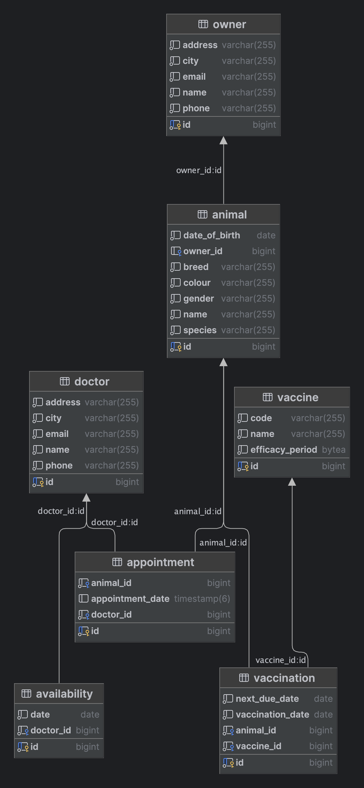

# Veterinary Management API

## Overview
The Veterinary Management API is a backend service designed for managing various aspects of a veterinary clinic.

## Getting Started

### Prerequisites
- **Java 17**
- **Maven**
- **PostgreSQL**

### Start PostgreSQL Server
**Create a new db with the following details:**

```yaml
    spring:
      datasource:
        url: jdbc:postgresql://localhost:5432/veterinary_management
        username: postgres
        password: postgres
  ```

### Fill Mock Data (*automatic*)
The application includes a `DataLoader` class that automatically populates the database with mock data upon startup. This class is responsible for creating sample owners, animals, doctors, availabilities, vaccines, and vaccinations, making it easier to test the API without needing to manually enter data.

Project is by default set to:
```yaml
ddl-auto: create-drop
```
This ensures each time the application is run there is identical mock data for testing purposes.

## Overview
This API includes functionalities for managing owners, animals, doctors, appointments, availabilities, vaccines, and vaccinations.

## Features
- **Owner Management**: Create, update, delete, and retrieve owners of pets.
- **Animal Management**: Manage animals, including their details and associated vaccinations.
- **Doctor Management**: Handle doctors' information and their availability for appointments.
- **Appointment Scheduling**: Schedule and manage appointments between doctors and animals.
- **Vaccination Tracking**: Keep track of vaccinations for animals, including due dates and vaccine details.
- **Availability Management**: Manage doctors' availability for appointments.

## Technologies Used
- **Spring Boot**: A framework for building Java-based web applications.
- **Spring Data JPA**: For data persistence and database interactions.
- **PostgreSQL**: A relational database management system used for storing data.
- **MapStruct**: A code generator for bean mapping.
- **Lombok**: To reduce boilerplate code in Java classes.
- **Maven**: For project management and build automation.

## Veterinary Clinic Database Schema


## API Endpoints
## Base URL
```
http://localhost:8080/api
```
### Owners

<details>
<summary>Create Owner</summary>

- **URL:** `/owners`
- **Method:** `POST`
- **Request Body:**
  ```json
  {
    "name": "John Doe",
    "phone": "555-1234",
    "email": "john.doe@example.com",
    "address": "123 Main St",
    "city": "City 1"
  }
  ```

</details>

<details>
<summary>Get Owner by ID</summary>

- **URL:** `/owners/{id}`
- **Method:** `GET`

</details>

<details>
<summary>Get All Owners</summary>

- **URL:** `/owners`
- **Method:** `GET`
- **Query Parameters:**
  - `name` (optional): Filter by name

</details>

<details>
<summary>Update Owner</summary>

- **URL:** `/owners/{id}`
- **Method:** `PUT`
- **Request Body:**
  ```json
  {
    "name": "John Doe",
    "phone": "555-1234",
    "email": "john.doe@example.com",
    "address": "123 Main St",
    "city": "City 1"
  }
  ```

</details>

<details>
<summary>Delete Owner</summary>

- **URL:** `/owners/{id}`
- **Method:** `DELETE`

</details>

<details>
<summary>Add Animal to Owner</summary>

- **URL:** `/owners/{id}/animals`
- **Method:** `POST`
- **Request Body:**
  ```json
  {
    "name": "Rex",
    "species": "Dog",
    "breed": "Labrador",
    "gender": "Male",
    "colour": "Black",
    "dateOfBirth": "2020-01-01"
  }
  ```

</details>

### Animals

<details>
<summary>Create Animal</summary>

- **URL:** `/animals`
- **Method:** `POST`
- **Request Body:**
  ```json
  {
    "name": "Rex",
    "species": "Dog",
    "breed": "Labrador",
    "gender": "Male",
    "colour": "Black",
    "dateOfBirth": "2020-01-01"
  }
  ```

</details>

<details>
<summary>Get Animal by ID</summary>

- **URL:** `/animals/{id}`
- **Method:** `GET`

</details>

<details>
<summary>Get All Animals</summary>

- **URL:** `/animals`
- **Method:** `GET`
- **Query Parameters:**
  - `name` (optional): Filter by name

</details>

<details>
<summary>Update Animal</summary>

- **URL:** `/animals/{id}`
- **Method:** `PUT`
- **Request Body:**
  ```json
  {
    "name": "Rex",
    "species": "Dog",
    "breed": "Labrador",
    "gender": "Male",
    "colour": "Black",
    "dateOfBirth": "2020-01-01"
  }
  ```

</details>

<details>
<summary>Delete Animal</summary>

- **URL:** `/animals/{id}`
- **Method:** `DELETE`

</details>

<details>
<summary>Get Vaccinations by Animal ID</summary>

- **URL:** `/animals/{id}/vaccinations`
- **Method:** `GET`

</details>

<details>
<summary>Create Vaccination for Animal</summary>

- **URL:** `/animals/{id}/vaccinations`
- **Method:** `POST`
- **Request Body:**
  ```json
  {
    "vaccineId": 1,
    "vaccinationDate": "2023-01-01"
  }
  ```

</details>

### Doctors

<details>
<summary>Create Doctor</summary>

- **URL:** `/doctors`
- **Method:** `POST`
- **Request Body:**
  ```json
  {
    "name": "Dr. John Smith",
    "phone": "555-1234",
    "email": "dr.john@example.com",
    "address": "123 Main St",
    "city": "City 1"
  }
  ```

</details>

<details>
<summary>Get Doctor by ID</summary>

- **URL:** `/doctors/{id}`
- **Method:** `GET`

</details>

<details>
<summary>Get All Doctors</summary>

- **URL:** `/doctors`
- **Method:** `GET`

</details>

<details>
<summary>Update Doctor</summary>

- **URL:** `/doctors/{id}`
- **Method:** `PUT`
- **Request Body:**
  ```json
  {
    "name": "Dr. John Smith",
    "phone": "555-1234",
    "email": "dr.john@example.com",
    "address": "123 Main St",
    "city": "City 1"
  }
  ```

</details>

<details>
<summary>Delete Doctor</summary>

- **URL:** `/doctors/{id}`
- **Method:** `DELETE`

</details>

<details>
<summary>Add Availability to Doctor</summary>

- **URL:** `/doctors/{doctorId}/availabilities`
- **Method:** `POST`
- **Request Body:**
  ```json
  {
    "date": "2023-12-01"
  }
  ```

</details>

### Appointments

<details>
<summary>Create Appointment</summary>

- **URL:** `/appointments`
- **Method:** `POST`
- **Request Body:**
  ```json
  {
    "doctorId": 1,
    "animalId": 1,
    "appointmentDate": "2023-12-01T14:00:00"
  }
  ```

</details>

<details>
<summary>Get Appointment by ID</summary>

- **URL:** `/appointments/{id}`
- **Method:** `GET`

</details>

<details>
<summary>Get All Appointments</summary>

- **URL:** `/appointments`
- **Method:** `GET`
- **Query Parameters:**
  - `startDate` (optional): Filter by start date
  - `endDate` (optional): Filter by end date
  - `doctorId` (optional): Filter by doctor ID
  - `animalId` (optional): Filter by animal ID

</details>

<details>
<summary>Update Appointment</summary>

- **URL:** `/appointments/{id}`
- **Method:** `PUT`
- **Request Body:**
  ```json
  {
    "doctorId": 1,
    "animalId": 1,
    "appointmentDate": "2023-12-01T14:00:00"
  }
  ```

</details>

<details>
<summary>Delete Appointment</summary>

- **URL:** `/appointments/{id}`
- **Method:** `DELETE`

</details>

### Availabilities

<details>
<summary>Create Availability</summary>

- **URL:** `/availabilities`
- **Method:** `POST`
- **Request Body:**
  ```json
  {
    "doctorId": 1,
    "date": "2023-12-01"
  }
  ```

</details>

<details>
<summary>Get Availability by ID</summary>

- **URL:** `/availabilities/{id}`
- **Method:** `GET`

</details>

<details>
<summary>Get All Availabilities</summary>

- **URL:** `/availabilities`
- **Method:** `GET`
- **Query Parameters:**
  - `doctorId` (optional): Filter by doctor ID

</details>

<details>
<summary>Update Availability</summary>

- **URL:** `/availabilities/{id}`
- **Method:** `PUT`
- **Request Body:**
  ```json
  {
    "doctorId": 1,
    "date": "2023-12-01"
  }
  ```

</details>

<details>
<summary>Delete Availability</summary>

- **URL:** `/availabilities/{id}`
- **Method:** `DELETE`

</details>

### Vaccines

<details>
<summary>Create Vaccine</summary>

- **URL:** `/vaccines`
- **Method:** `POST`
- **Request Body:**
  ```json
  {
    "name": "Rabies Vaccine",
    "code": "RV-01",
    "efficacyPeriod": "P1Y"
  }
  ```

</details>

<details>
<summary>Get Vaccine by ID</summary>

- **URL:** `/vaccines/{id}`
- **Method:** `GET`

</details>

<details>
<summary>Get All Vaccines</summary>

- **URL:** `/vaccines`
- **Method:** `GET`
- **Query Parameters:**
  - `name` (optional): Filter by name

</details>

<details>
<summary>Update Vaccine</summary>

- **URL:** `/vaccines/{id}`
- **Method:** `PUT`
- **Request Body:**
  ```json
  {
    "name": "Rabies Vaccine",
    "code": "RV-01",
    "efficacyPeriod": "P1Y"
  }
  ```

</details>

<details>
<summary>Delete Vaccine</summary>

- **URL:** `/vaccines/{id}`
- **Method:** `DELETE`

</details>

### Vaccinations

<details>
<summary>Create Vaccination</summary>

- **URL:** `/vaccinations`
- **Method:** `POST`
- **Request Body:**
  ```json
  {
    "vaccineId": 1,
    "animalId": 1,
    "vaccinationDate": "2023-01-01"
  }
  ```

</details>

<details>
<summary>Get Vaccination by ID</summary>

- **URL:** `/vaccinations/{id}`
- **Method:** `GET`

</details>

<details>
<summary>Get All Vaccinations</summary>

- **URL:** `/vaccinations`
- **Method:** `GET`

</details>

<details>
<summary>Get Expiring Vaccinations</summary>

- **URL:** `/vaccinations/expiring`
- **Method:** `GET`
- **Query Parameters:**
  - `start` (required): Start date for the range
  - `end` (required): End date for the range

</details>

<details>
<summary>Update Vaccination</summary>

- **URL:** `/vaccinations/{id}`
- **Method:** `PUT`
- **Request Body:**
  ```json
  {
    "vaccineId": 1,
    "animalId": 1,
    "vaccinationDate": "2023-01-01"
  }
  ```

</details>

<details>
<summary>Delete Vaccination</summary>

- **URL:** `/vaccinations/{id}`
- **Method:** `DELETE`

</details>
